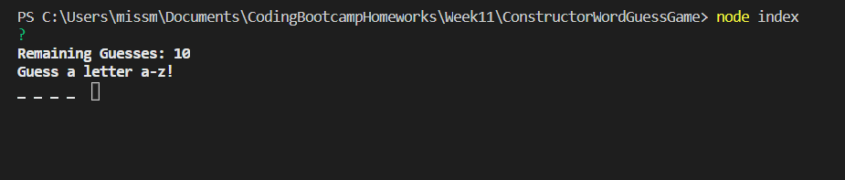
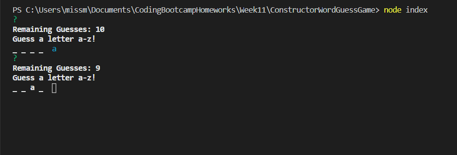
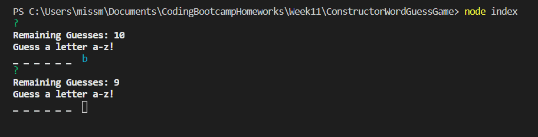
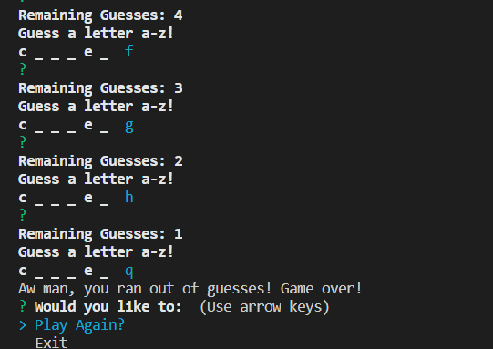
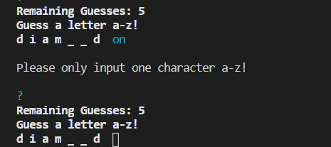

# Constructor Word Guessing Game

No HTML file for this project.

# Overview
In this assignment, a word guessing game was created with the use of constructors so that the user would be able to use the terminal in order to play a hangman game within the command-line. This game was created using 3 files, each requiring a different function from the other in order for the game to be fully functional.

# Tools Used
● Constructors  
● Javascript  
● Require tag

# Nodes Used - Prerequisites
● Inquirer

# Usage
This project can be used to play a game of hangman. It is up to the user to figure out the theme of the words that are in the game.  
To start the game, first download inquirer within the terminal using the commands:  
<b>'npm init -y'</b> and then <b>'npm i inquirer'</b>  
Next you will type in:  
<b>'node index'</b>   
to run start your game.  
There is no timer so you can think about each word carefully, but you will only be given 10 attempts to guess the word correctly.  
  
Upon entering a letter that is in the randomly generated word, it will be displayed to the player in place of one of the '_'  
  
When the user is unable to guess the correct letter that goes to the hidden word they will have one of the guesses taken away from them.  

If the user fails to guess the word within the allotted number of tries, they will instead be met with the 'Game Over' screen where they will have the choice to either quit the game or try to beat the game again.  
  
One of the changes I was able to add to the game to improve the experience of the player is that the game will not allow for < 1 || > 1 characters. Preventing the player from losing one of their attempts due to a misclick.  

